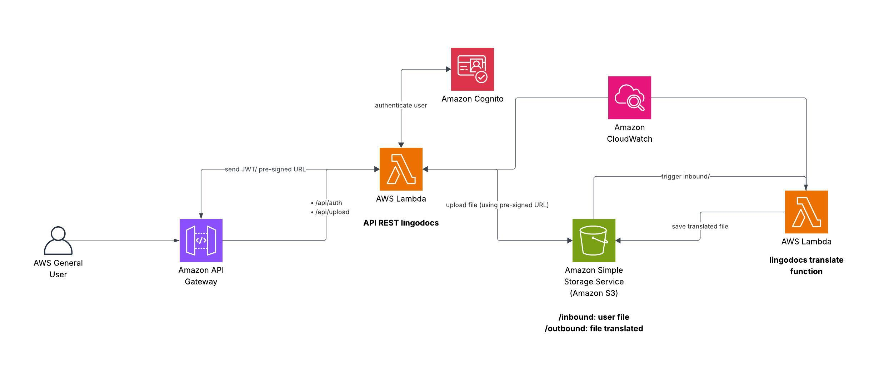

# API Lingodocs

A API Lingodocs permite a tradução automática de arquivos `.txt` utilizando serviços da AWS e Gemini.

> 🌟 Essa API foi construída com o objetivo de integrar os principais serviços da AWS como parte do meu estudo. É um projeto básico e que pode ter erros, mas o objetivo principal foi de entender como esses serviços funcionavam e como integrar eles.

> 🚨 A tradução dos arquivos é gerada por Inteligência Artificial, então é sempre importante revisar conteúdo gerado.
> 🔗 Confira a função responsável pela tradução: https://github.com/NataliaFrancisca/lingodocs-translate

## Visão Geral
A API fornece:
- autenticação via Amazon Cognito
- Upload de arquivos `.txt` para o Amazon S3
- Tradução automática dos arquivos via Lambda + IA
- Listagem dos arquivos traduzidos
- Geração de URL para download seguro

## Recursos Disponíveis
- Cadastro, confirmação e autenticação de usuários
- Upload de arquivo `.txt`
- Disparo automático da tradução (função Lambda)
- Listagem de arquivos traduzidos
- Geração de URL temporária para download

## Fluxo da Aplicação
1. Usuário cria conta via API.
2. Cognito envia um código de confirmação por e-mail.
3. Usuário confirma o cadastro e realiza login.
4. A API retorna um JWT, usado para acessar os demais serviços.
5. Usuário faz upload de um `.txt`. O arquivo é enviado ao S3.
6. A Lambda `lingodocs-translate` lê arquivos de `inbound/`, traduz e salva em `outbound/`.
7. A API permite listar arquivos traduzidos e gerar a URL de download.

## Endpoints
### Autenticação:
| rota | método | body |
|------|--------|------|
| ``/api/auth/signup`` | POST | ``{ "name": "...", "email": "...", "password": "..." }`` |
| ``/api/auth/confirm`` | POST | ``{ "email": "...", "token": "..." }`` | 
| ``/api/auth/signin`` | POST |  ``"email": "...", "password": "..." }`` | 
| ``/api/auth/refresh`` | POST | ``{ "refreshToken": "..."}`` | 

### Arquivos:
| rota | método | body | auth |
|------|--------|------|------|
| ``/api/file/upload`` | POST | ``{"file": "..."}`` | JWT |
| ``/api/file/all`` | GET | - | JWT |
| ``/api/file`` | GET | ``{ "name": "..." }`` | JWT |

## Arquitetura

## Tecnologias Utilizadas
Backend
- Java
- Spring Boot
- JWT Authentication
IA
- Gemini API (Google)
AWS
- Amazon S3
- Amazon Lambda
- Amazon API Gateway
- Amazon Cognito
- Amazon CloudWatch
